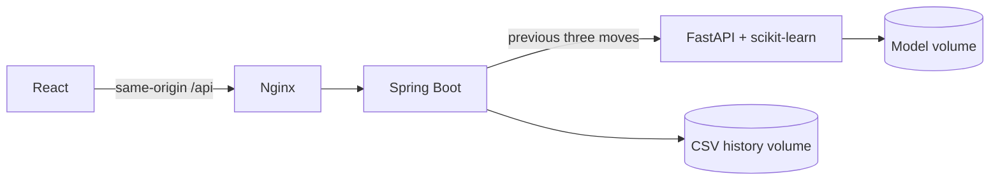

# Jack-En-Poy AI

[](https://github.com/rojerm2/jack-en-poy-ai/actions/workflows/validate.yml)
[](LICENSE)

A rock-paper-scissors game with a React interface, a Spring Boot API, and a Python prediction service.
The computer predicts from your three previous completed moves and counters the prediction.
Repeated moves use a separate repetition rule; warmup and unavailable inference use random play.

**[Try the browser demo](https://rojerm2.github.io/jack-en-poy-ai/)** · **[Releases](https://github.com/rojerm2/jack-en-poy-ai/releases)**

The browser demo runs entirely on your device. It includes animation, scores, keyboard controls,
random play and repetition counters. It does not run the trained model, contact a backend, or save
gameplay. Use Docker to try the complete application.

## Quick start

Install Docker Engine or Docker Desktop with Compose v2, then run:

```sh
git clone https://github.com/rojerm2/jack-en-poy-ai.git
cd jack-en-poy-ai
docker compose up --build --detach --wait
```

Open **http://localhost:8088**. Choose a move or use **R / P / S**. Results and scores appear
after the three-beat chant. **New game** resets the current session.

```sh
docker compose logs --follow
docker compose stop
```

The first build downloads dependencies and trains the sample model. Java and Python run on a
private container network; only the frontend is exposed, on loopback by default. Named volumes
retain CSV history, models and reports across container replacement. Session scores and inference
history remain in memory and reset when the backend restarts.

See [deployment and operations](docs/deployment.md) for configuration, retraining, backups and updates.

## Gameplay

- First-person SVG hands and a timed Jack-En-Poy reveal.
- Keyboard controls, reduced-motion support, session scores and recent rounds.
- `ML`: counter the trained model's prediction from completed history.
- `ADAPTIVE`: when the previous three moves are identical and inference is available, counter that move.
- `RANDOM`: warmup, disabled inference, timeouts and prediction-service failures.
- Separate sample counts and observed win rates for each strategy; no fabricated model confidence for rules.

The repetition rule assumes a streak continues. Changing your next move can beat it. The current move
is never sent to Python or used to choose the counter.

## Architecture



| Component | Stack | Directory |
| --- | --- | --- |
| Frontend | React 19, TypeScript, Vite, Tailwind | [web/jack-en-poy-ai](web/jack-en-poy-ai) |
| Game API | Java 21, Spring Boot 4.1, Maven wrapper | [core/jack-en-poy-ai](core/jack-en-poy-ai) |
| Prediction | Python 3.12, FastAPI, scikit-learn | [ml](ml) |

See [architecture](ARCHITECTURE.md) and [design decisions](DECISIONS.md) for runtime behavior and model evaluation.

## Local development

Prerequisites: Java 21, Node 24 and Python 3.12. Use three terminals from the repository root.

```powershell
# Prediction service
cd ml
python -m venv .venv
.\.venv\Scripts\python.exe -m pip install -r requirements-lock.txt
.\.venv\Scripts\python.exe -m src.dataset.main
.\.venv\Scripts\python.exe retrain.py --history data/raw/game-history.csv --compare
.\.venv\Scripts\python.exe -m uvicorn service:app --host 127.0.0.1 --port 8001
```

```powershell
# Game API
cd core/jack-en-poy-ai
.\mvnw.cmd spring-boot:run
```

```powershell
# Frontend
cd web/jack-en-poy-ai
npm ci
npm run dev
```

Open http://127.0.0.1:5173. On Linux/macOS use `python3`, `.venv/bin/python` and `./mvnw`.
Press Ctrl+C in each terminal to stop the services. For a frontend-only preview, run
`npm run build:demo` followed by `npm run preview -- --outDir dist-demo` in the frontend directory.

## Evaluation and limits

The checked-in 146-round sample selects logistic regression through three chronological training
folds. Its holdout accuracy is **42.31% on 26 rows**. The holdout is separated by a three-window gap
and excluded from model selection. This small reused sample does not establish general improvement
over random play. Confidence is uncalibrated; live strategy win rates are observational.

The complete application is designed for one backend instance and anonymous local gameplay.
It keeps up to 1000 sessions in memory and serializes rounds. Restart or eviction resets session
state. There is no account system or request deduplication; a lost response may represent a saved
round, with scores resynchronized on the next successful response. The model is global and does
not retrain itself while you play. See [future work](TODO.md).

## Development and releases

[Contributing](CONTRIBUTING.md) documents the test commands. CI checks Python, Java, normal/demo
frontend builds, dependency consistency, real-service integration, and Docker deployment behavior.
Release downloads include the packaged backend, browser demo, Python module and SHA-256 checksums.

[Changelog](CHANGELOG.md) · [Security](SECURITY.md) · [MIT license](LICENSE)
